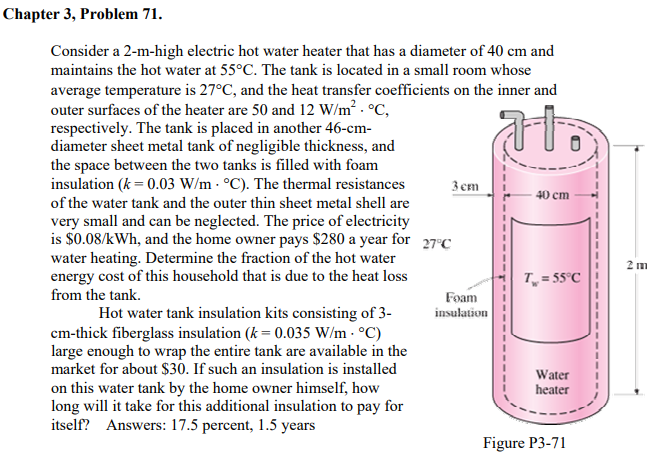
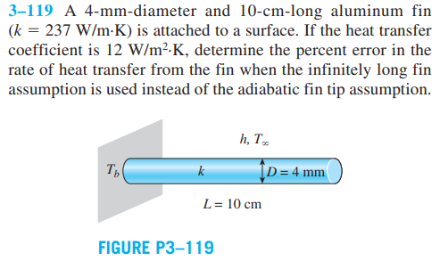

# transcalmod
A heat and mass transport module. We're in construction!! 🚧👷🚧  

## Requirements
This class makes use of some Python's modules [Numpy](https://numpy.org/), [MatPlotLib](https://matplotlib.org/) and [Sympy](https://www.sympy.org).

## Lets solve this thermal resistance problem


```python
    from transcalmod import thermal_resistance_1D as tr 
    from numpy import pi 

    heater = {
        'Tconv_inner': ['convection','', pi*40e-2*2, 50, {}],
        'T_insulation': ['conduction','cylinder_radial', '', 0.03, 
            {'length':2, 'angle':2*pi, 'R_inner':20e-2, 'R_outter':23e-2}],
        'Tconv_inner': ['convection','', pi*46e-2*2, 12, {}]
    }

    dft_res = tr(resistance_dic=heater, suppress=True)
    Q_loss = (55-27)/sum(dft_res.values())
    heat_loss_cust = Q_loss*24*365*0.08e-3
    heat_loss_cust_perc = 100*Q_loss/280

    # Update!
    heater['T_glass'] = ['conduction','cylinder_radial', '', 0.035, 
            {'length':2, 'angle':2*pi, 'R_inner':23e-2, 'R_outter':23e-2+3e-2}]
        
    up_res = tr(resistance_dic=heater, suppress=True)
    Qup_loss = (55-27)/sum(dft_res.values())
    recover_time = 30/((Q_loss-Qup_loss)*24*0.08e-3)-1 

    print('The heat loss is {:0.2f}% of the total cust'.format(heat_loss_cust_perc))
    print('The recover time for the heater update will happens in {:0.0f} months'.format(recover_time))
```

## Quick Set Up


```python
    from transcalmod import Fin_1D_Model as fin_model
    from sympy import simplify, symbols
    from numpy import pi 

    # We don't know its values, but thats ok!
    # If we pass it as sympy symbols the fin_model handles it.
    T_inf, T_b = symbols('T_inf, T_b')

    physics = {'k':237, 'h':12, 'T_base':T_b, 'T_env':T_inf}
    geom = {'cross_area':pi*(2e-3)**2, 'perimeter':pi*4e-3, 'length':10e-2}

    # Creating the model
    fin = fin_model(physics_data=physics, geometry_data=geom)

    # Solving it for the long boundary conditions
    fin.solve(boundary_condition='infinitely_long_fin')
    Q_lf = fin.get_heat_transfer(position=0)

    # Solving it for tha adiabatic tip boundary conditions
    fin.solve(boundary_condition='adiabatic_tip')
    Q_a = fin.get_heat_transfer(position=0)

    # Finding the error
    err = simplify(Q_lf/Q_a)

    print('The error will is about {:0.2f}%'.format(100*(err-1)))
```

## End
Hope you like it! :grin:
Please, consider hitting the star button!!!